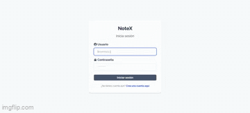
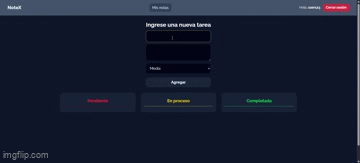

# NoteX 📝

**NoteX** es una aplicación web full-stack diseñada para la gestión eficiente de notas y tareas personalizadas. Cuenta con autenticación segura de usuarios basada en roles, persistencia de datos en la nube y una interfaz moderna y responsiva.

---

## Demo en Vivo

* **Frontend App:** [https://notex-frontend.vercel.app](https://notex-frontend.vercel.app)
* **Backend API:** [https://notex-backend-vgmu.onrender.com](https://notex-backend-vgmu.onrender.com)

> 🔑 **Cuenta de Prueba (Demo):**
> * **Usuario:** `user123`
> * **Contraseña:** `uSer_pRUeba_123456`

---

## Tecnologías Utilizadas

### Frontend
* **React** (Vite)
* **React Router DOM** (Navegación SPA)
* **Context API** (Gestión de estado global)
* **CSS / Tailwind** (Diseño de interfaz)

### Backend
* **Node.js** & **Express** (API RESTful)
* **JSON Web Tokens (JWT)** & **Cookies HTTPOnly** (Autenticación y seguridad)
* **CORS** & **Cookie-Parser** (Gestión de sesiones)
* **Zod / Schema Validation** (Validación de datos)

### Base de Datos & Despliegue
* **MongoDB Atlas** (Base de datos NoSQL)
* **Mongoose** (ODM)
* **Vercel** (Despliegue del Frontend)
* **Render** (Despliegue del Backend)

---

## Características Principales

* **Autenticación y Autorización:** Registro, inicio de sesión y validación de tokens JWT mediante cookies seguras.
* **Control de Roles:** Gestión diferenciada para usuarios y administradores.
* **Gestión de Tareas (CRUD):** Creación, lectura, actualización y eliminación de tareas en tiempo real.
* **Diseño Responsivo:** Adaptado a pantallas móviles y de escritorio.

---

## Demostración

<p align="center">
  
  
</p>

---

## Estructura del Proyecto

```text
PROYECT-TASKX/
├── backend/
│   ├── controllers/        # Controladores de la API
│   ├── middlewares/        # Middlewares (autenticación, validación)
│   ├── models/             # Modelos de Mongoose (Users, Tasks)
│   ├── requests/           # Archivos de prueba de endpoints
│   ├── routes/             # Rutas Express (/users, /tasks)
│   ├── schema/             # Esquemas de validación
│   ├── .env                # Variables de entorno local
│   ├── package.json
│   └── server.js           # Punto de entrada del servidor Backend
│
└── frontend/
    ├── public/             # Archivos estáticos y favicons
    ├── src/
    │   ├── api/            # Configuración de peticiones HTTP
    │   ├── assets/         # Recursos multimedia e imágenes
    │   ├── components/     # Componentes reutilizables
    │   ├── context/        # Contextos globales de React
    │   ├── hooks/          # Custom Hooks de React
    │   ├── layouts/        # Estructuras de diseño general
    │   ├── pages/          # Páginas/Vistas principales
    │   ├── routes/         # Configuración de rutas del cliente
    │   ├── App.jsx         # Componente principal
    │   └── main.jsx        # Punto de entrada de React
    ├── .env                # Variables de entorno local
    ├── index.html          # Documento HTML principal
    └── package.json
```

---

## ⚙️ Configuración e Instalación Local

Si deseas ejecutar este proyecto de manera local en tu máquina:

### 1. Clonar el repositorio
```bash
git clone https://github.com/angierojas02/proyect-taskx.gitcd notex
```

### 2. Configurar el Backend
```bash
cd backend
npm install
```

Crea un archivo `.env` en la carpeta `backend`:
```env
PORT=1234
MONGO_URI=tu_conexion_mongodb
JWT_SECRET=tu_secreto_jwt
FRONTEND_URL=http://localhost:5173
NODE_ENV=development
```

Inicia el servidor backend:
```bash
npm run dev
```

### 3. Configurar el Frontend
En otra terminal:
```bash
cd frontend
npm install
```

Crea un archivo `.env` en la carpeta `frontend`:
```env
VITE_API_URL=http://localhost:1234
```

Inicia la aplicación cliente:
```bash
npm run dev
```

---

## Licencia

Este proyecto está bajo la Licencia MIT.
